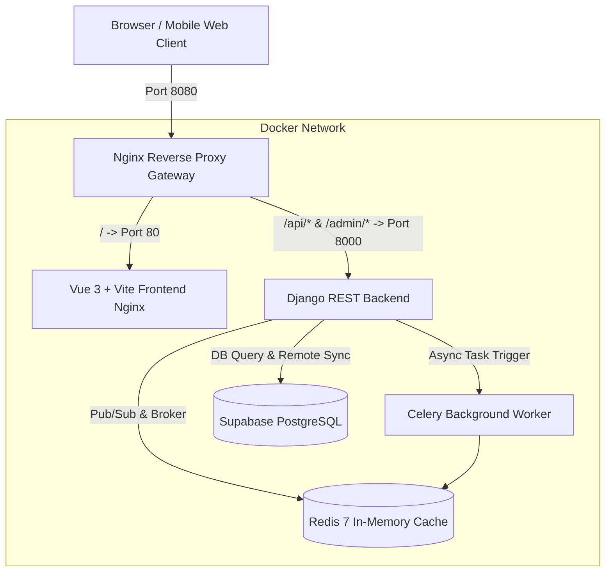

# 🌿 Karina Wellness Booking Platform (`wellness_app`)

An end-to-end, high-performance boutique wellness booking and service delivery web application. The platform provides a seamless digital experience for discovering wellness services (holistic yoga, restorative sound baths, deep tissue therapy, reformer pilates, and meditation), scheduling slots in real-time, executing instant mobile payments via M-Pesa STK Push, and tracking personal wellness sessions.

Built with a modern reactive **Vue 3 + Vite** frontend, a scalable **Django REST Framework** backend connected to **Supabase**, asynchronous processing powered by **Celery & Redis**, and a production-ready **Nginx** reverse proxy gateway—all orchestrated with **Docker Compose**.

---

## 📑 Table of Contents
- [Architecture Overview](#-architecture-overview)
- [Key Features](#-key-features)
- [Technology Stack](#-technology-stack)
- [Repository Structure](#-repository-structure)
- [Quick Start with Docker Compose](#-quick-start-with-docker-compose)
- [Local Development Setup](#-local-development-setup)
  - [Backend (Django & Celery)](#1-backend-setup)
  - [Frontend (Vue 3 + Vite)](#2-frontend-setup)
- [API Endpoints Reference](#-api-endpoints-reference)
- [Stitch Design System](#-stitch-design-system)
- [Security & Environment Variables](#-security--environment-variables)
- [License](#-license)

---

## 🏛 Architecture Overview



---

## ✨ Key Features

### 💻 Client Web Experience (Frontend)
- **High-Converting Landing & Welcome Pages**: Immersive hero branding, studio philosophy, practitioner highlights, and direct entry points to onboarding.
- **Dynamic Service Catalog**: Categorized wellness offerings (Yoga, Pilates, Massage, Meditation, Sound Healing) with duration, intensity level, practitioner profile, and transparent pricing.
- **Interactive Calendar & Slot Booking**: Real-time date selection and morning/afternoon/evening time-slot booking with capacity constraints.
- **M-Pesa STK Push & Flexible Payments**: One-tap mobile money checkout with automated reference code generation (`QK######`), instant receipt confirmation, and voucher/package redemption.
- **My Bookings Dashboard**: Manage active, upcoming, completed, and rescheduled reservations with calendar sync and cancellation workflows.
- **User Authentication & Session Management**: Secure signup/login with token-based authentication and persistent state.
- **Adaptive Theme System**: Curated dark and light wellness aesthetics adhering to Material 3 design tokens.

### ⚙️ Backend & API Capabilities
- **RESTful API**: Comprehensive CRUD endpoints built with Django REST Framework.
- **Supabase Integration**: Cloud-native PostgreSQL persistence for services, slots, bookings, and customer profiles.
- **Asynchronous Task Queue (Celery + Redis)**: Background payment verification, simulated M-Pesa STK push handling, and booking notification pipelines.
- **Reverse Proxy Gateway**: Centralized routing, CORS management, and static file acceleration through Nginx.

---

## 🛠 Technology Stack

| Domain | Technology | Description |
|---|---|---|
| **Frontend Framework** | [Vue 3](https://vuejs.org/) (Composition API) | Reactive single-page application |
| **Frontend Tooling** | [Vite 5](https://vitejs.dev/) | Lightning-fast build and hot module replacement |
| **Styling & CSS** | [Tailwind CSS 3](https://tailwindcss.com/) | Bespoke wellness color palette and responsive tokens |
| **Backend Framework** | [Django 4.x / DRF](https://www.django-rest-framework.org/) | Robust Python REST API framework |
| **Database** | [Supabase](https://supabase.com/) & SQLite | Remote PostgreSQL database with client SDK |
| **Async Tasks & Broker**| [Celery](https://docs.celeryq.dev/) & [Redis 7](https://redis.io/) | Background task queue for payment & notification logic |
| **Proxy / Web Server** | [Nginx Alpine](https://nginx.org/) | Reverse proxy gateway routing frontend and backend |
| **Containerization** | [Docker](https://www.docker.com/) & Docker Compose | Multi-container reproducible stack |
| **Design System** | [Google Stitch](https://stitch.withgoogle.com/) | High-fidelity Material 3 design system and screen specs |

---

## 📂 Repository Structure

```text
wellness_app/
├── .gitignore                      # Git ignore rules (node_modules, .env, __pycache__, db.sqlite3)
├── docker-compose.yml              # Multi-container orchestration (Nginx, Backend, Frontend, Celery, Redis)
├── LICENSE                         # MIT License
├── README.md                       # Complete platform documentation
│
├── backend/                        # Django REST API Service
│   ├── .env.example                # Sample environment configuration
│   ├── Dockerfile                  # Production container definition for Django
│   ├── manage.py                   # Django management script
│   ├── requirements.txt            # Python dependencies (Django, DRF, Celery, Supabase, etc.)
│   ├── karina_backend/             # Project settings, URL routing, Celery configuration
│   │   ├── celery.py
│   │   ├── settings.py
│   │   ├── urls.py
│   │   └── wsgi.py
│   └── booking_api/                # Core API Application
│       ├── apps.py
│       ├── serializers.py          # Data validation serializers
│       ├── supabase_client.py      # Supabase cloud database integration layer
│       ├── tasks.py                # Asynchronous Celery jobs (M-Pesa, notifications)
│       ├── urls.py                 # REST route definitions
│       └── views.py                # API endpoints
│
├── frontend/                       # Vue 3 Single Page Application
│   ├── Dockerfile                  # Multi-stage production build (Node 20 -> Nginx)
│   ├── index.html                  # HTML entrypoint with Outfit & Plus Jakarta Sans typography
│   ├── nginx.conf                  # Nginx configuration for serving SPA build
│   ├── package.json                # Frontend dependencies & scripts
│   ├── tailwind.config.js          # Tailwind theme tokens & color schemas
│   ├── vite.config.js              # Vite bundler configuration
│   └── src/
│       ├── App.vue                 # Root layout container
│       ├── main.js                 # App initialization
│       ├── assets/                 # Global styles and typography rules
│       ├── components/             # Reusable UI components (Navbar, Header, BottomNav)
│       ├── router/                 # Vue Router routes
│       ├── services/               # Axios / fetch API client service
│       ├── stores/                 # State management (authStore, bookingStore, themeStore)
│       └── views/                  # Primary screen views
│           ├── AdminDashboardView.vue # Boutique Admin operations & session scheduler
│           ├── AuthView.vue        # Login & Registration
│           ├── BookSessionView.vue # Date & Time slot picker
│           ├── CheckoutView.vue    # M-Pesa STK Push payment flow
│           ├── HomeView.vue        # Dashboard feed
│           ├── LandingPageView.vue # Public brand landing page
│           ├── MyBookingsView.vue  # User booking history & reschedule
│           ├── ServiceDetailView.vue# Service breakdown & practitioner info
│           ├── ServicesView.vue    # Filterable catalog
│           └── WelcomeView.vue     # Onboarding splash
│
├── nginx/                          # Reverse Proxy Gateway
│   └── nginx.conf                  # Main entrypoint routing /api/, /admin/, and /
│
└── stitch_karina_wellness_booking_platform/ # UI/UX Design System & Stitch Prototypes
    ├── karina_wellness_studio/     # DESIGN.md token specifications
    ├── booking_date_time/          # Slot reservation prototype & HTML
    ├── brand_logo/                 # Official studio badge asset
    ├── home_feed/                  # Home dashboard prototype & HTML
    ├── karina_profile/             # Lead therapist portrait asset
    ├── my_bookings/                # Booking management screen prototype
    ├── payment_m_pesa_checkout/    # Payment modal prototype
    ├── services_book/              # Services overview prototype
    └── welcome_onboarding/         # Welcome onboarding prototype
```

---

## 🚀 Quick Start with Docker Compose

The easiest way to run the entire platform (Frontend, Backend, Redis, Celery, and Nginx) is using Docker Compose:

1. **Clone the repository and enter the directory**:
   ```bash
   git clone https://github.com/DEVgrown/wellness_app.git
   cd wellness_app
   ```

2. **Configure Environment Variables**:
   ```bash
   cp backend/.env.example backend/.env
   ```
   *(Update Supabase keys and Django secrets in `backend/.env` if using custom credentials).*

3. **Build and start all containers**:
   ```bash
   docker compose up --build -d
   ```

4. **Access the application**:
   - **Main Web Application**: [http://localhost:8080](http://localhost:8080)
   - **Direct Frontend**: [http://localhost:5173](http://localhost:5173)
   - **Browsable API Root**: [http://localhost:8080/api/](http://localhost:8080/api/)
   - **Django Admin Portal**: [http://localhost:8080/admin/](http://localhost:8080/admin/)

5. **Stop containers**:
   ```bash
   docker compose down
   ```

---

## 💻 Local Development Setup

If you prefer running services directly on your host machine for development:

### 1. Backend Setup

**Prerequisites**: Python 3.10+, Redis server running on `localhost:6379`.

```bash
cd backend

# Create and activate virtual environment
python -m venv venv
# On Windows:
.\venv\Scripts\activate
# On Linux/macOS:
source venv/bin/activate

# Install dependencies
pip install -r requirements.txt

# Setup environment variables
cp .env.example .env

# Run database migrations
python manage.py migrate

# (Optional) Create superuser for Django admin
python manage.py createsuperuser

# Start the Django development server
python manage.py runserver 8000
```

To run the background task worker (in a separate terminal):
```bash
cd backend
celery -A karina_backend worker -l info
```

### 2. Frontend Setup

**Prerequisites**: Node.js 18+ and npm.

```bash
cd frontend

# Install packages
npm install

# Start Vite hot-reload development server
npm run dev
```

The frontend will start at [http://localhost:5173](http://localhost:5173) and proxies `/api/` calls directly to the Django server on port 8000.

---

## 📡 API Endpoints Reference

| Method | Endpoint | Description |
|---|---|---|
| `GET` | `/api/` | Directory root and health check |
| `GET` | `/api/services/` | List all services (supports `?category=` and `?location=`) |
| `GET` | `/api/services/<id>/` | Retrieve details for a specific wellness service |
| `GET` | `/api/slots/` | Query slot availability (supports `?service_id=` and `?date=`) |
| `GET` | `/api/bookings/` | Retrieve user bookings (supports `?user_name=` and `?status=`) |
| `POST` | `/api/bookings/` | Create a new booking and issue reference code (`QK######`) |
| `POST` | `/api/bookings/reschedule/` | Reschedule an existing booking to a new date/time |
| `POST` | `/api/payments/mpesa-stk/` | Trigger M-Pesa STK push prompt and queue Celery verification |
| `GET` | `/api/user-packages/` | Fetch active user class packages and remaining sessions |
| `POST` | `/api/auth/signup/` | Register a new user account |
| `POST` | `/api/auth/login/` | Authenticate user and receive auth token |
| `POST` | `/api/auth/logout/` | Invalidate current user session token |
| `GET` | `/api/auth/me/` | Retrieve authenticated user profile |
| `GET` | `/api/admin/overview/` | Admin KPI metrics & recent activity |
| `GET` / `POST` | `/api/admin/services/` | List and create offerings with prices, duration, and capacity |
| `PATCH` / `DELETE`| `/api/admin/services/<id>/` | Update or remove service offerings and cascade slot cleanup |
| `GET` / `POST` | `/api/admin/slots/` | Query or create individual session time slots |
| `POST` | `/api/admin/slots/bulk-generate/`| Bulk-generate recurring weekly slots across date ranges |
| `PATCH` / `DELETE`| `/api/admin/slots/<id>/` | Edit capacity, mark full, or delete a session slot |
| `GET` | `/api/admin/bookings/` | Retrieve all client bookings across studio roster with search |
| `PATCH` / `DELETE`| `/api/admin/bookings/<id>/` | Modify booking status, reschedule, add coach notes, or delete |
| `GET` / `POST` | `/api/admin/customers/` | List all registered clients with booking & spend stats, or onboard new client |
| `GET` / `PATCH` | `/api/admin/customers/<id>/` | Retrieve customer profile with all bookings & packages, or edit user data |
| `POST` | `/api/admin/customers/<id>/passes/`| Issue or credit session package passes to a client account |


---

## 🎨 Stitch Design System

The visual direction follows Google Stitch design system standards located in `stitch_karina_wellness_booking_platform/karina_wellness_studio/DESIGN.md`.

- **Colors**: Deep navy (`#00163c`), calming surface whites (`#faf8ff`), serene container accents (`#d9e2ff`), and earthy wellness hues.
- **Typography**: Google Fonts [`Outfit`](https://fonts.google.com/specimen/Outfit) for confident editorial headings and [`Plus Jakarta Sans`](https://fonts.google.com/specimen/Plus+Jakarta+Sans) for crisp, readable body text.
- **Elevations & Borders**: Soft 24px-32px border radiuses, translucent backdrop filters, and subtle ambient shadows for high-end spa aesthetic.

---

## 🔒 Security & Environment Variables

- Never commit `.env` or sensitive API keys to source control.
- An environment template is provided at `backend/.env.example`.
- Ensure production deployments generate a unique `SECRET_KEY`, disable `DEBUG`, and define strict `ALLOWED_HOSTS` and `CORS_ALLOWED_ORIGINS`.

---

## 📄 License

This project is licensed under the MIT License - see the [LICENSE](LICENSE) file for details.
